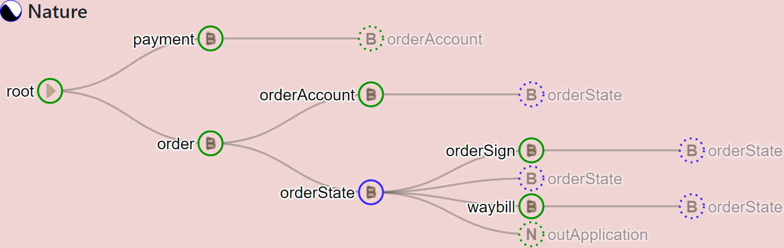

# nature-manager-ui

You can use this project to manage Meta and Relation of [Nature](https://github.com/llxxbb/Nature) 

Please user version 0.20.1 or above of Nature.



## Change Logs

**v0.1.1** 2021-01-23

- bug fix: change mock data to real data, now you see every thing which defined in tables, 

**v0.1.0** 2021-01-19

- can show `Meta` and `Relation`, but can't add, edit etcetera.

## Project setup
```
npm install
```

### Compiles and hot-reloads for development
```
npm run serve
```

### Compiles and minifies for production
```
npm run build
```

### Run your unit tests
```
npm run test:unit
```

### Customize configuration
See [Configuration Reference](https://cli.vuejs.org/config/).
